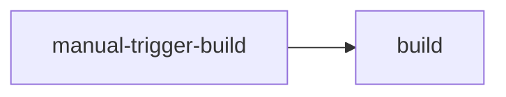
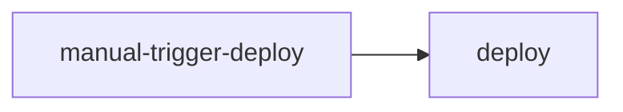
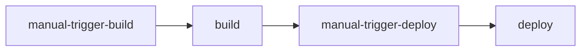

# Manual-Trigger v1

Allows you to setup a manual trigger for a workflow so subsequent jobs can be skipped if the trigger is not run or if the jobs need to be run at a later time.

# Usage

For each manual step you must rerun the step to execute the manual trigger. The first automatic ci run will skip the subsequent jobs linked to the manual trigger with needs.

`RUN_NAME` must be unique for each manual step added

```yaml
manual-step-name:
  runs-on: ubuntu-latest
  outputs:
      CONTINUE_JOBS: ${{ steps.manual-trigger.outputs.CONTINUE_JOBS }}
  steps:
    - name: manual-trigger
      id: manual-trigger
      uses: benhamiltonpro/manual-trigger@v1
      with:
        RUN_NAME: "manual-step"
step-awaiting-manual-trigger:
  needs: manual-step-name
  if: ${{ needs.manual-step-name.outputs.CONTINUE_JOBS == 'true' }}
  ... do things
```

## Manual Trigger Single Job

```yaml
...
manual-step-name:
  runs-on: ubuntu-latest
  outputs:
      CONTINUE_JOBS: ${{ steps.manual-trigger.outputs.CONTINUE_JOBS }}
  steps:
    - name: manual-trigger
      id: manual-trigger
      uses: benhamiltonpro/manual-trigger@v1
      with:
        RUN_NAME: "build"
build:
  needs: manual-trigger-build
  if: ${{ needs.manual-trigger-build.outputs.CONTINUE_JOBS == 'true' }}
  runs-on: ubuntu-latest
  steps:
    - name: Runs plan
      run: echo "It runs plan"
```



## Manual Trigger More Than One Job

```yaml
...
manual-trigger-build:
  runs-on: ubuntu-latest
  outputs:
      CONTINUE_JOBS: ${{ steps.manual-trigger.outputs.CONTINUE_JOBS }}
  steps:
    - name: manual-trigger
      id: manual-trigger
      uses: benhamiltonpro/manual-trigger@v1
      with:
        RUN_NAME: "build"
build:
  needs: manual-trigger-build
  if: ${{ needs.manual-trigger-build.outputs.CONTINUE_JOBS == 'true' }}
  runs-on: ubuntu-latest
  steps:
    - name: Runs plan
      run: echo "It runs plan"

manual-trigger-deploy:
  runs-on: ubuntu-latest
  outputs:
      CONTINUE_JOBS: ${{ steps.manual-trigger.outputs.CONTINUE_JOBS }}
  steps:
    - name: manual-trigger
      id: manual-trigger
      uses: benhamiltonpro/manual-trigger@v1
      with:
      RUN_NAME: "deploy"
deploy:
  needs: manual-trigger-deploy
  if: ${{ needs.manual-trigger-deploy.outputs.CONTINUE_JOBS == 'true' }}
  runs-on: ubuntu-latest
  steps:
    - name: Runs deploy
      run: echo "It runs deploy"
```



## Manual Trigger Sequential Jobs
```yaml
...
manual-trigger-build:
  runs-on: ubuntu-latest
  outputs:
      CONTINUE_JOBS: ${{ steps.manual-trigger.outputs.CONTINUE_JOBS }}
  steps:
    - name: manual-trigger
      id: manual-trigger
      uses: benhamiltonpro/manual-trigger@v1
      with:
        RUN_NAME: "build"
build:
  needs: manual-trigger-build
  if: ${{ needs.manual-trigger-build.outputs.CONTINUE_JOBS == 'true' }}
  runs-on: ubuntu-latest
  steps:
    - name: Runs plan
      run: echo "It runs plan"

manual-trigger-deploy:
  needs: build
  runs-on: ubuntu-latest
  outputs:
      CONTINUE_JOBS: ${{ steps.manual-trigger.outputs.CONTINUE_JOBS }}
  steps:
    - name: manual-trigger
      id: manual-trigger
      uses: benhamiltonpro/manual-trigger@v1
      with:
        RUN_NAME: "deploy"
deploy:
  needs: manual-trigger-deploy
  if: ${{ needs.manual-trigger-deploy.outputs.CONTINUE_JOBS == 'true' }}
  runs-on: ubuntu-latest
  steps:
    - name: Runs deploy
      run: echo "It runs deploy"
```


# License

The scripts and documentation in this project are released under the [MIT License](LICENSE)